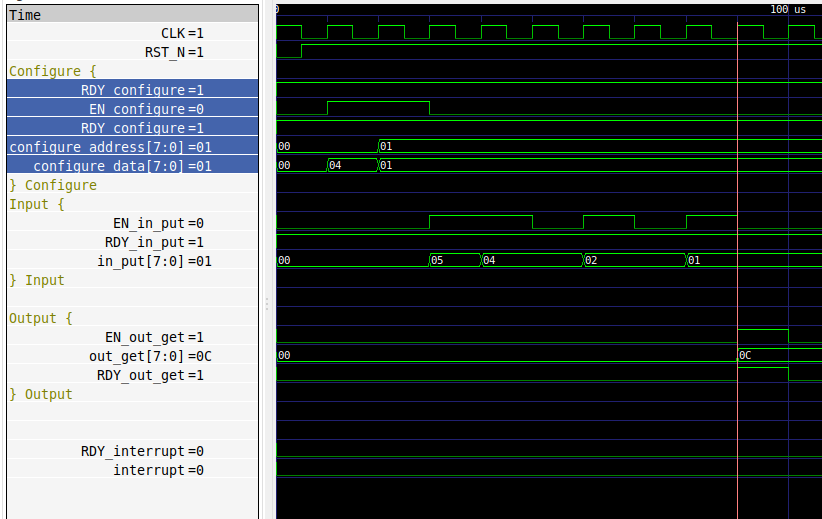

# NCGPythonCocotb

Written test for applicants for Python + Cocotb QC developer

# Introduction

This test requires an understanding of 

1. Python3
2. cocotb framework
3. Testing methodologies

For the specification below:

1. Write a testspecification with a testcase table.
2. Using cocotb framework implement any 2 testcases of which one should be a datapath (din to dout) test.

# Specification

Sum of N Module.

## Introduction.
This module can be programmed to add N 8 bit data.
It accepts one 8 bit data per cycle,
Once N inputs are available it output's the sum of the N bytes.

The Module has the following interfaces:

* **Configure** Takes address and data as input,
  * address:0 = Length, The value written to address 0 is the 'N' Value,
  * address:1 = start bit, A write to address 1 starts the accumulate +sum process. the start bit is cleared after N inputs are accumulated.
* **in_put** 8 bit data input.
* **out_put** 8 bit data output.
* **interrupt** Raised when there is an exception condition, e.g. an input transaction when start is not set.

## Req, En Protocol.

A transaction happens on an interface when both Req and En are high in a given clock cycle.
En can never be high unless Req is high.

## Device under test I/O Signals

The I/O Signals are

### Out Interface

| Name        | I/O      | size    | props   |
| --------    | -------- | ------- | ------- |
| EN_out_get  | I        | 1       |         |
| out_get     | O        | 8       | reg     |
| RDY_out_get | O        | 1       |         |

### Interrupt Interface

| Name          | I/O      | size    | props   |
| --------      | -------- | ------- | ------- |
| interrupt     | O        | 1       |         |
| RDY_interrupt | O        | 1       | const   |
  
### Clock and reset

| Name     | I/O      | size    | props   |
| -------- | -------- | ------- | ------- |
| CLK      | I        | 1       | clock   |
| RST_N    | I        | 1       | reset   |

### Input interface

  | Name       | I/O      | size    | props   |
  | --------   | -------- | ------- | ------- |
  | RDY_in_put | O        | 1       | const   |
  | in_put     | I        | 8       |         |
  | EN_in_put  | I        | 1       |         |

### Configuration interface

| Name              | I/O      | size    | props   |
| --------          | -------- | ------- | ------- |
| RDY_configure     | O        | 1       | const   |
| configure_address | I        | 8       |         |
| configure_data    | I        | 8       | reg     |
| EN_configure      | I        | 1       |         |

A sample transaction waveform

# How to take the test

1. Clone this repository.
2. Create your testspecification and  and testcase list and upload it to the doc folder
3. Setup cocotb environment and implement the testcases in the tb folder.
4. Create a pull request with the changes above.

## Qualifying criteria:

1. Correctness and completeness of the testplan.
2. Error free Python code.
3. Correctness of the testcase implementation.

**In case of any doubts/issues please raise a ticket at https://github.com/dyumnin/NCGPythonCocotb/issues**

# Cheatsheet

1. Information related to cocotb docs.cocotb.org/ 
2. Starting point for learning about software testing. https://en.wikipedia.org/wiki/Software_testing
3. https://www.softwaretestinghelp.com/how-to-write-effective-test-cases-test-cases-procedures-and-definitions/

